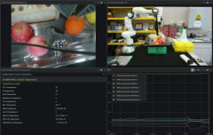
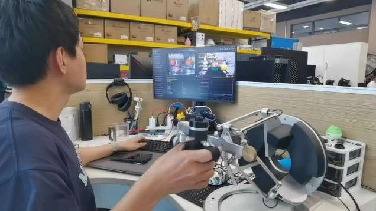

# franka_omega_ros2 — Franka FR3 × Omega7 遥操作系统

本仓库在 [frankaemika/franka_ros2](https://github.com/frankaemika/franka_ros2) 的基础上，增加了基于 **Force Dimension Omega7** 触觉主手的遥操作功能，实现对 **Franka Research 3 (FR3)** 机械臂的实时阻抗遥操作，并支持力反馈回传。

---
## Demo Video（演示视频）
从端视角[](<https://github.com/user-attachments/assets/b4db1ad7-4333-440a-ae90-3959940e6b03>)
操作端视角[](<https://github.com/user-attachments/assets/fd63114d-1f20-4d3b-943d-ab05e954fb37>)
## 目录

- [系统概述](#系统概述)
- [硬件与软件依赖](#硬件与软件依赖)
- [系统架构](#系统架构)
- [受控端（Franka FR3）](#受控端franka-fr3)
  - [核心控制器：JointImpedanceMoveItController](#核心控制器jointimpedancemoveitcontroller)
  - [关键话题与参数](#关键话题与参数)
  - [启动方法](#启动方法)
- [主操作端（Omega7）](#主操作端omega7)
- [环境安装](#环境安装)
  - [本地安装](#本地安装)
  - [Docker 安装](#docker-安装)
- [构建与测试](#构建与测试)
- [常见问题](#常见问题)
- [许可证](#许可证)

---

## 系统概述

本系统由两端组成：

| 端 | 硬件 | 软件包 | 作用 |
|---|---|---|---|
| **主操作端** | Force Dimension **Omega7** | [ICUBE-ROBOTICS/forcedimensionROS](https://github.com/ICube-Robotics/forcedimension_ros2) | 采集操作者手部末端位姿并发送到受控端；接收力反馈并驱动 Omega7 产生力觉 |
| **受控端** | Franka Research 3 (**FR3**) | 本仓库 `hello_moveit` 包 | 订阅末端目标位姿，通过 MoveIt IK 求逆解，用关节阻抗控制驱动机械臂；同时估算接触力并回传 |

---

## 硬件与软件依赖

- **操作系统**：Ubuntu 22.04
- **ROS 版本**：ROS 2 Humble
- **机械臂**：Franka Research 3（FR3），搭载 Franka 夹爪
- **主手**：[Force Dimension Omega7](https://www.forcedimension.com/products/omega)
- **主手 ROS 驱动**：[ICUBE-ROBOTICS/forcedimension_ros2](https://github.com/ICube-Robotics/forcedimension_ros2)
- **MoveIt 2**：用于在线逆运动学（`/compute_ik` 服务）
- **franka_ros2**：libfranka 的 ROS 2 封装（本仓库上游）

---

## 系统架构

```
┌─────────────────────────────────────┐        ┌──────────────────────────────────────────┐
│          主操作端（Omega7）           │        │          受控端（Franka FR3）              │
│                                     │        │                                          │
│  forcedimension_ros2 驱动           │        │  JointImpedanceMoveItController          │
│  ┌──────────────────────────────┐   │        │  ┌────────────────────────────────────┐  │
│  │ 读取 Omega7 末端位姿          │   │  位姿  │  │ 订阅 /fd/ee_pose                   │  │
│  │ 发布 /fd/ee_pose             │──────────>│  │ 调用 /compute_ik (MoveIt)          │  │
│  │ 发布 TF: fd_base/fd_ee 等    │   │        │  │ 关节阻抗控制律: τ = K(qd-q)-D(dq̇) │  │
│  └──────────────────────────────┘   │        │  │ 估算末端接触力 (Jacobian + 动力学)  │  │
│  ┌──────────────────────────────┐   │  力反馈 │  │ 发布 /fd/fd_controller/commands   │  │
│  │ 订阅 /fd/fd_controller/      │<──────────│  └────────────────────────────────────┘  │
│  │        commands              │   │        │                                          │
│  │ 驱动 Omega7 输出力觉          │   │        │  Franka Gripper (Move / Grasp Action)    │
│  └──────────────────────────────┘   │        │  订阅 /fd/index_pose (食指位姿 → 夹爪宽度) │
└─────────────────────────────────────┘        └──────────────────────────────────────────┘
```

---

## 受控端（Franka FR3）

### 核心控制器：JointImpedanceMoveItController

位于 `hello_moveit/` 包，以 `ros2_control` pluginlib 插件形式注册，类型名为  
`franka_example_controllers/JointImpedanceMoveItController`。

**工作流程：**

1. 订阅主操作端发布的末端目标位姿（`/fd/ee_pose`，类型 `geometry_msgs/PoseStamped`）。
2. 将位姿转换至机器人 `base` 坐标系，并进行姿态补偿（绕 X 轴旋转 π）。
3. 异步调用 MoveIt `/compute_ik` 服务求解 7 自由度逆运动学。
4. 对目标关节角施加步长限制（`max_joint_step_ = 0.002 rad/周期`），平滑插值至期望位置。
5. 执行关节阻抗控制律：
   ```
   τ = K · (qd - q) - D · dq_filtered
   ```
   力矩及力矩变化率均有安全限制。
6. 通过 Jacobian 和机器人动力学模型估算末端接触力，经带通滤波后发布至 `/fd/fd_controller/commands`，驱动 Omega7 产生力反馈。
7. 通过 TF 追踪 `fd_virtual_clutch_link`（食指位姿），估算手指张开宽度并周期性发送夹爪控制指令（Franka Gripper Move Action）。

### 关键话题与参数

| 话题 | 方向 | 类型 | 说明 |
|------|------|------|------|
| `/fd/ee_pose` | 订阅 | `geometry_msgs/PoseStamped` | Omega7 末端目标位姿（主手发布） |
| `/fd/fd_controller/commands` | 发布 | `std_msgs/Float64MultiArray` | 力反馈指令，回传给主手（7维：fx, fy, fz, tx, ty, tz, 0） |
| `/fd/index_pose` | 发布 | `geometry_msgs/PoseStamped` | 食指位姿（调试用） |

| 参数 | 默认值 | 说明 |
|------|--------|------|
| `ee_pose_topic` | `/fd/ee_pose` | 末端位姿话题名 |
| `arm_id` | `fr3` | 机械臂 ID |
| `joints` | `[fr3_joint1 … fr3_joint7]` | 关节名列表 |
| `k_gains` | `[100.0 × 7]` | 阻抗刚度增益 |
| `d_gains` | `[10.0 × 7]` | 阻抗阻尼增益 |
| `ik_timeout` | `0.2 s` | IK 求解超时时间 |

### 启动方法

**实体机器人（FR3）：**

```bash
# 终端 1：启动 franka_ros2 + MoveIt
ros2 launch hello_moveit moveitfranka.launch.py robot_ip:=<机器人IP>

# 终端 2：启动 Omega7 驱动（参见主操作端说明）
```

**仿真（fake hardware）：**

```bash
ros2 launch franka_fr3_moveit_config moveit.launch.py robot_ip:=dont-care use_fake_hardware:=true
```

---

## 主操作端（Omega7）

主操作硬件为 **Force Dimension Omega7**，使用 **[ICUBE-ROBOTICS/forcedimension_ros2](https://github.com/ICube-Robotics/forcedimension_ros2)** 驱动包（原名 `forcedimensionROS`）。

该包负责：
- 读取 Omega7 的末端位置与姿态，发布为 `geometry_msgs/PoseStamped`（话题 `/fd/ee_pose`）；
- 维护 Omega7 的 TF 树（`fd_base` → `fd_yaw_link` → `fd_virtual_clutch_link` 等）；
- 订阅 `/fd/fd_controller/commands`（`std_msgs/Float64MultiArray`，7维力/力矩），驱动 Omega7 输出力反馈。

**安装与启动请参考上游文档：**  
[https://github.com/ICube-Robotics/forcedimension_ros2](https://github.com/ICube-Robotics/forcedimension_ros2)

安装 Force Dimension SDK 后，启动主手驱动节点：

```bash
ros2 launch forcedimension_ros2 fd.launch.py
```

---

## 环境安装

### 本地安装

1. **安装 ROS 2 Humble**

    参考官方文档：<https://docs.ros.org/en/humble/Installation/Ubuntu-Install-Debs.html>

    ```bash
    # 选择 Desktop 或 Bare Bones（推荐 Desktop）
    sudo apt install ros-humble-desktop
    sudo apt install ros-dev-tools
    source /opt/ros/humble/setup.sh
    ```

2. **创建工作空间并克隆本仓库**

    ```bash
    mkdir -p ~/franka_ros2_ws/src
    cd ~/franka_ros2_ws
    git clone https://github.com/LJY008/franka_omega_ros2.git src
    ```

3. **拉取 franka_ros2 上游依赖**

    ```bash
    vcs import src < src/franka.repos --recursive --skip-existing
    ```

4. **安装 ROS 依赖**

    ```bash
    rosdep install --from-paths src --ignore-src --rosdistro humble -y
    ```

5. **克隆并安装 forcedimension_ros2（主手驱动）**

    ```bash
    git clone https://github.com/ICube-Robotics/forcedimension_ros2.git src/forcedimension_ros2
    # 按照该仓库说明安装 Force Dimension SDK
    rosdep install --from-paths src/forcedimension_ros2 --ignore-src --rosdistro humble -y
    ```

6. **编译**

    ```bash
    colcon build --symlink-install --cmake-args -DCMAKE_BUILD_TYPE=Release
    source install/setup.bash
    ```

### Docker 安装

本仓库继承了上游的 `Dockerfile` 与 `docker-compose.yml`。

```bash
echo -e "USER_UID=$(id -u $USER)\nUSER_GID=$(id -g $USER)" > .env
docker compose build
docker compose up -d
docker exec -it franka_ros2 /bin/bash
# 在容器内执行上述步骤 3–6
```

---

## 构建与测试

```bash
colcon build --symlink-install --cmake-args -DCMAKE_BUILD_TYPE=Release
colcon test
```

> ⚠️ 本项目处于开发阶段，构建时可能出现警告，属正常现象。

---

## 常见问题

#### `libfranka: UDP receive: Timeout error`

- 避免使用 Docker Desktop，改用 Docker Engine。
- 建议为机器人控制机安装实时内核，参考 [Franka 安装文档](https://frankaemika.github.io/docs/installation_linux.html#setting-up-the-real-time-kernel)。

#### IK 求解失败 / 无法找到 `/compute_ik` 服务

- 确认 MoveIt `move_group` 节点已启动，且使用的 `arm_id` 与 URDF/MoveIt 配置一致（默认 `fr3`）。

#### Omega7 无力反馈

- 检查 `/fd/fd_controller/commands` 话题是否有数据发布；
- 确认 forcedimension_ros2 驱动节点正常运行，Force Dimension SDK 版本兼容。
- 
#### GPU驱动无法安装  

- 安装实时内核后，GPU驱动可能会失败安装。有关解决方案，请参阅 [this article](http://mp.weixin.qq.com/s?__biz=Mzg4MjYyMjMzOA==&mid=2247484925&idx=1&sn=bb94e17f1028a7d67b733f3e4a3f2610&chksm=ce4ecc06b37828b6ac0cded76369bac27b1451c29237dc1bbc013f6aa24b0790567235749674&mpshare=1&scene=24&srcid=0411pfhDbAJ7LDb3szd7LVOB&sharer_shareinfo=d462800fa0d38c7f695aee7e5965750b&sharer_shareinfo_first=54a68e31a1b7ea93808c9caf9d55481b#rd).  
---

## 许可证

- 本仓库中来自 `frankaemika/franka_ros2` 的代码遵循 **Apache 2.0** 许可证。
- `hello_moveit` 包（遥操作控制器）遵循 **MIT** 许可证。

---

## 参考链接

- [Franka Robotics FCI 文档](https://frankaemika.github.io/docs)
- [franka_ros2 上游仓库](https://github.com/frankaemika/franka_ros2)
- [ICUBE-ROBOTICS/forcedimension_ros2](https://github.com/ICube-Robotics/forcedimension_ros2)
- [Force Dimension Omega7](https://www.forcedimension.com/products/omega)
- [MoveIt 2 文档](https://moveit.picknik.ai/humble/index.html)
